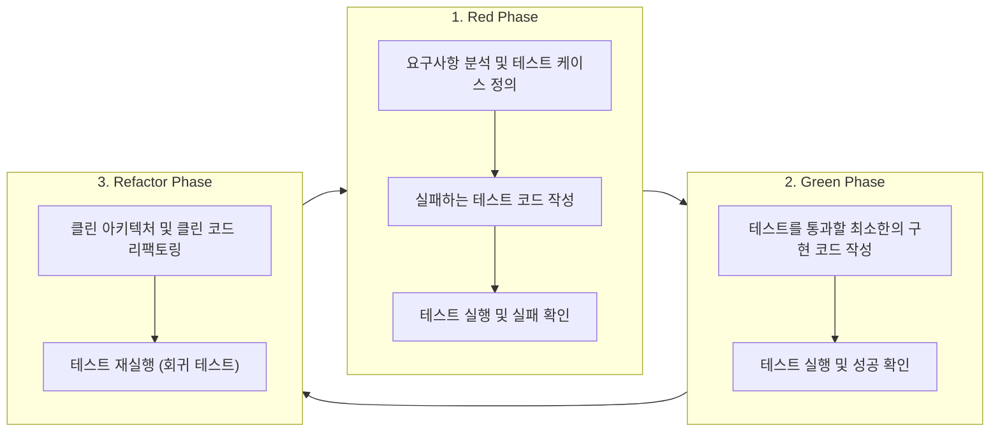

# Test-Driven Development (TDD) Protocol & Guidelines

본 문서는 본 프로젝트에서 **테스트 주도 개발(TDD, Test-Driven Development)**을 엄격하고 효율적으로 수행하기 위한 개발 프로토콜 및 에이전트 지침서입니다.

---

## 1. TDD 핵심 원칙: Red-Green-Refactor 사이클

모든 기능 구현 및 버그 수정은 반드시 아래의 **3단계(Red ➔ Green ➔ Refactor)** 사이클을 엄격히 준수합니다.



### 1) Red Phase (실패하는 테스트 작성)
> [!IMPORTANT]
> 구현 코드를 한 줄도 작성하기 전에, 기대하는 동작과 실패 조건을 정의하는 테스트를 먼저 작성합니다.

- 인터페이스(Port), Use Case 명세, 입력/출력값(DTO)을 바탕으로 테스트를 설계합니다.
- 작성된 테스트를 실행하여 **의도한 이유로 실패(Failing for the right reason)**하는지 검증합니다. (단순 문법 에러가 아닌 비즈니스 로직 미구현에 따른 실패).

### 2) Green Phase (최소 코드로 테스트 통과)
- 실패한 테스트를 통과시키는 데 필요한 **가장 단순하고 최소한의 코드**만 작성합니다.
- 이 단계에서는 과도한 최적화나 복잡한 추상화를 지양하고, 오직 테스트 통과(Green)에 집중합니다.
- 테스트를 즉시 실행하여 모든 케이스가 통과하는지 확인합니다.

### 3) Refactor Phase (품질 개선 및 검증)
- 테스트가 모두 통과한 상태에서 코드 품질을 개선합니다:
  - 중복 코드 제거 및 가독성 향상
  - [클린 아키텍처](file:///d:/Data/Antigravity/ecommerce/.agents/rules/architecture.md) 계층 규칙 준수 (Domain, Application, Infrastructure 분리)
  - [Next.js 프레임워크 룰](file:///d:/Data/Antigravity/ecommerce/.agents/rules/nextjs-framework.md) 준수 (Server Components 최적화, 200줄 이내 분할)
- **회귀 검증(Regression Check)**: 리팩토링 후에도 기존 테스트가 깨지지 않고 100% 통과함을 재확인합니다.

---

## 2. 테스트 피라미드 (Testing Pyramid) 3단계 구축

본 프로젝트는 단위, 통합, E2E 테스트를 상호 보완적으로 작성하여 높은 신뢰도를 확보합니다.

| 분류 | 대상 및 범위 | 사용 도구 | 속도 및 비중 |
| :--- | :--- | :--- | :--- |
| **Unit Test** (단위 테스트) | • 순수 Domain Entities 및 비즈니스 규칙<br>• Application Use Cases<br>• DTO 검증 및 순수 유틸리티 함수 | Vitest / Jest | 빠름 (70%) |
| **Integration Test** (통합 테스트) | • Supabase Repository 구현체 (Mock/DB 연동)<br>• Server Actions (`'use server'`)<br>• React 컴포넌트 렌더링 및 인터랙션 | Vitest + React Testing Library | 중간 (20%) |
| **E2E Test** (종단간 테스트) | • 관리자 로그인 ➔ 대시보드 지표 확인<br>• 상품 등록 ➔ 목록 노출 ➔ 상세 수정<br>• 주문 접수 ➔ 배송 상태 변경 플로우 | Playwright | 느림 (10%) |

---

## 3. 테스트 커버리지 기준 (Code Coverage Target)

> [!TIP]
> 본 프로젝트의 테스트 코드 커버리지는 **80% 이상**을 상시 유지합니다.

```
--------------------------------------------------------------------------------
Coverage Metrics       Target Rate    Mandatory Criteria
--------------------------------------------------------------------------------
Lines Coverage         >= 80%         핵심 실행 경로 80% 이상
Statements Coverage    >= 80%         모든 구문 실행 보장
Branches Coverage      >= 80%         조건문(if/else, switch, ternary) 분기 검증
Functions Coverage     >= 80%         선언된 함수 및 메소드 호출 검증
--------------------------------------------------------------------------------
```

- **Domain (`domain/`) & Application (`application/use-cases/`) 계층**: 비즈니스 핵심 로직으로 **90% 이상**의 높은 커버리지를 권장합니다.
- 단순 타입 선언(`*.d.ts`), 정적 상수 파일, 설정 파일은 커버리지 측정 대상에서 제외할 수 있습니다.

---

## 4. 테스트 실행 및 실패 분석 루프 (Failure Analysis & Fix)

모든 구현 및 변경 작업 후에는 반드시 테스트를 자동 실행하고 아래 절차를 따릅니다.

### 1) 실행 명령어
```bash
npm run test           # 단위 및 통합 테스트 전체 실행
npm run test:coverage  # 커버리지 리포트 생성 및 80% 달성 여부 확인
npm run test:e2e       # Playwright E2E 테스트 실행
```

### 2) 테스트 실패 시 근본 원인 분석(RCA) 프로세스
만약 통과하지 못한 테스트가 발생할 경우 임의로 넘어가거나 테스트 코드를 무단 삭제하지 않고, 아래 **4단계 근본 원인 분석(Root Cause Analysis)**을 거쳐 수정합니다:

1. **실패 현상 파악**: 에러 메시지, Stack Trace, Expected vs Received 값 정밀 비교.
2. **원인 분류**:
   - `구현 결함(Implementation Bug)`: 비즈니스 규칙 미반영, 경계값(Edge case) 미처리, Null/Undefined 예외
   - `환경/비동기 문제(Timing/Async Issue)`: Promise 미대기(`await` 누락), Mock 데이터 불일치
   - `요구사항 변경`: 기획 명세 변경에 따른 테스트 케이스 갱신 필요
3. **수정 및 재검증**:
   - 원인을 문서나 로그로 명시한 후 최소한의 코드로 결함을 수정합니다.
4. **전체 테스트 재실행**:
   - 실패했던 테스트뿐만 아니라 프로젝트 전체 테스트를 재실행하여 부수 효과(Side Effect)가 없음을 검증합니다.

---

## 5. TDD 실행을 위한 AI 에이전트 프롬프트 템플릿

사용자가 기능을 요청할 때 TDD 모드로 동작하도록 지시하는 표준 프롬프트입니다:

```markdown
당신은 엄격한 TDD(Test-Driven Development) 원칙을 준수하는 시니어 소프트웨어 엔지니어입니다.
아래의 규칙에 따라 작업을 진행해 주십시오:

1. [Red Phase]: 구현 전에 요구사항을 검증할 단위/통합 테스트 코드를 먼저 작성하고 실행하여 실패(Red)함을 확인하십시오.
2. [Green Phase]: 해당 테스트를 통과하기 위한 최소한의 구현 코드를 작성하고 테스트가 통과(Green)함을 확인하십시오.
3. [Refactor Phase]: 프로젝트의 Clean Architecture 및 Next.js 가이드라인에 맞추어 코드를 리팩토링하고 모든 테스트가 여전히 통과함을 확인하십시오.
4. [Coverage]: 라인/브랜치 커버리지 80% 이상을 달성하십시오.
5. [Verification & RCA]: 실패하는 테스트가 있다면 상세 원인을 분석하고 해결한 뒤 전체 테스트 결과를 보고하십시오.
```
